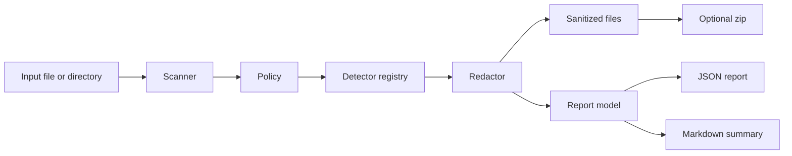

# Architecture

Date: 2026-06-10

## Overview

RedactPack is a small Python CLI with a pure redaction core. The core has no filesystem side effects. Filesystem scanning, package writing, reporting, and CLI parsing are separate modules.

## Modules

- `redactpack.models`: dataclasses and constants for findings, detector specs, reports, and severity ordering.
- `redactpack.detectors`: built-in regex/checksum detectors and detector registry.
- `redactpack.redactor`: deterministic placeholder assignment and text redaction.
- `redactpack.policy`: policy loading and validation.
- `redactpack.scanner`: file discovery, text reading, scan orchestration, dry-run support, and output writing.
- `redactpack.reports`: JSON and Markdown report rendering.
- `redactpack.benchmark`: corpus evaluation and recall metrics.
- `redactpack.cli`: argparse entrypoint.

## Data Flow

## Design Rules

- Detectors return candidate findings but do not mutate text.
- Redactor resolves overlaps and assigns placeholders.
- Scanner owns file IO and never alters input files.
- Reports contain placeholders and positions, not raw values or brute-forceable value hashes.
- User-facing language says reports are review aids, not safety guarantees.

## Prior-Art Positioning

RedactPack is ecosystem-neutral:

- Unlike `sos clean`, it is not tied to sos reports or RHEL-style support archives.
- Unlike troubleshoot.sh redactors, it does not require Kubernetes bundle specs.
- Unlike detect-secrets, it creates sanitized support handoff packages instead of repository baselines.
